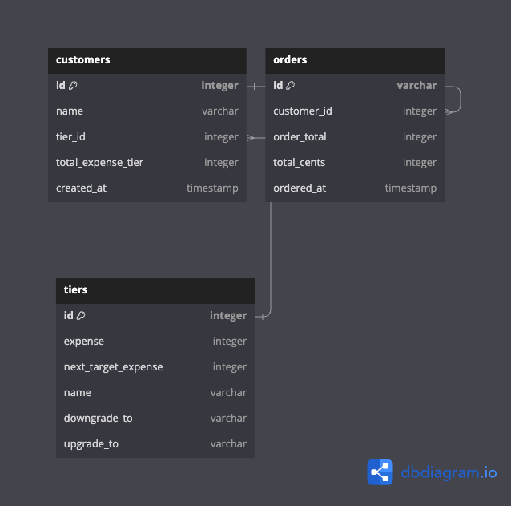

# loyaltyTiers

# Folder Structure

📦loyaltyTiers
<br>
┣ 📂client **-- React app**
<br>
┃ ┣ 📂public
<br>
┃ ┣ 📂src
<br>
┃ ┃ ┣ 📜CronJob.ts **--cron job to refresh tier calculation**
<br>
┃ ┃ ┣ 📂Apis **-- Api folder with config**
<br>
┃ ┃ ┣ 📂Components **-- Reusable components**
<br>
┃ ┃ ┣ 📂Pages
<br>
┃ ┃ ┣ 📂Routes
<br>
┃ ┃ ┣ 📂assets **-- GIF and SVG images to be used for loading animation**
<br>
┃ ┃ ┣ 📂dtos **--Contains definitions of expected response data model from servers**
<br>
┃ ┃ ┣ 📂models
<br>
┃ ┃ ┣ 📂types **--Contains query param interface**
<br>
┣ 📂server
<br>
┃ ┣ 📂dataset **--Contains pdf of data schema, datasets to create tables and insert dummy data right after docker compose runs.**
<br>
┃ ┣ 📂src
<br>
┃ ┃ ┣ 📂config **--api and database config**
<br>
┃ ┃ ┣ 📂controller
<br>
┃ ┃ ┣ 📂dtos **--Contains definitions of expected request data from clients**
<br>
┃ ┃ ┣ 📂router
<br>
┃ ┃ ┣ 📂types **--Contains definitions of query params, return data type, etc**
<br>

# DB Schema



# Setup for local development

clone the repo

```
git clone git@github.com:yk-jp/loyaltyTiers.git
```

run docker. (.env is stored already for the sake of making it simple to set up)

```
make
```

```
make run
```

You can access to postgreSQL by running

```
psql -U postgres123 -d db123 -h localhost
```

and entering password,

```
password123
```

open to see frontend page

```
http://localhost:3000
```

To add data to database, Please use the following endpoint

```
http://localhost:8080/order/complete
```

To reset data and start the app again, run

```
make delete-all
```

and

```
make
```

# Available APIs

| TYPE | API Endpoint                               |       Description        |
| :--: | :----------------------------------------- | :----------------------: |
| GET  | http://localhost:8080/customers            |    List all customers    |
| POST | http://localhost:8080/order/complete       |  Add Orders to database  |
| GET  | http://localhost:8080/customer/:customerId | List customer infomation |
| GET  | http://localhost:8080/order/:customerId    |  List Customer's Order   |

<br>

# Tech Stack

### Frontend

- HTML
- CSS
- React.js
- TypeScript
- Docker

### Backend

- Node.js
- TypeScript
- PostgreSQL
- Docker
